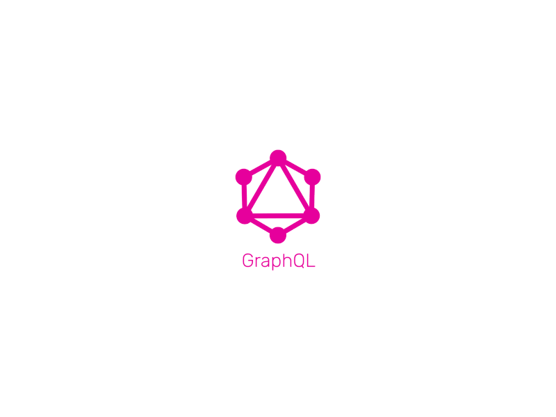
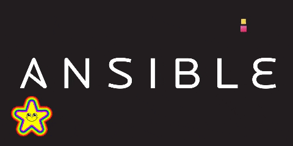
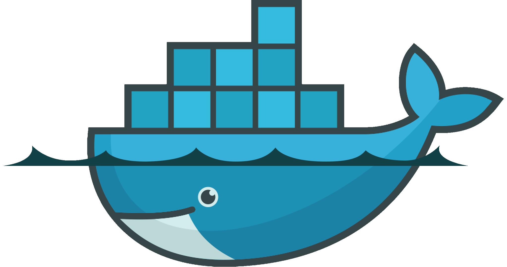

## **Hey 👋, I'm  SKAYY404!**  

### About Me  
I’m a DevOps and DevSecOps
 Engineer

My goal is to create reliable, scalable
and high — performance systems
 that enhance development and deployment processes.
  
  

</td><td valign="top" width="50%">

</td></tr></table>  

   

## Languages and Tools  

  
  
  

<!--    -->
<!--   
   -->
  
<!--    -->
  
  
  
<!--    -->
  
  
    
  
  
  
  
  
  
  

  

   

</td></tr></table>  

   

----

   

  
   

   

  

   

